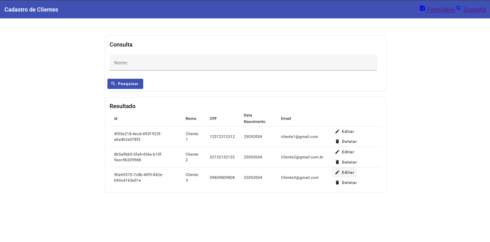
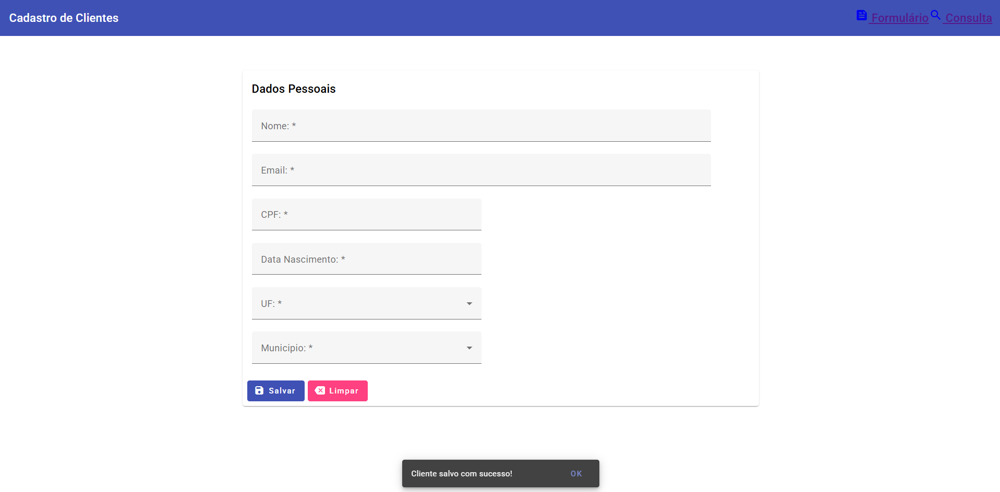

# 🧩 Angular Clients CRUD

## 📄 Descrição
Este é um projeto desenvolvido para demonstrar e praticar habilidades com **Angular**.  
A aplicação consiste em um **CRUD (Create, Read, Update, Delete)** completo de clientes, com toda a interface estilizada utilizando os componentes do **Angular Material**.

O principal objetivo deste projeto é servir como um **item de portfólio**, evidenciando o conhecimento em funcionalidades essenciais do framework Angular, como **componentização**, **consumo de APIs externas**, **reatividade** e **manipulação de formulários**.

Além das operações básicas de um CRUD, a aplicação se integra à **API governamental do IBGE**.  
O usuário seleciona um **Estado** em um campo de seleção e, com base nessa escolha, um segundo campo é populado dinamicamente com os **municípios correspondentes**, demonstrando a integração com serviços de terceiros e a reatividade da aplicação.

A **base de dados é local**, armazenada **no próprio navegador** (utilizando LocalStorage), garantindo persistência simples e independente de servidor.

---

## ✨ Funcionalidades

- **Cadastro de Clientes:** Formulário para adicionar novos clientes.  
- **Listagem de Clientes:** Exibição dos clientes cadastrados em uma tabela moderna e responsiva.  
- **Edição de Clientes:** Possibilidade de atualizar as informações de um cliente existente.  
- **Exclusão de Clientes:** Opção para remover um cliente da base de dados.  
- **Seleção de Localidade (IBGE API):** Integração com a API de localidades do IBGE.  
  A seleção de um Estado popula dinamicamente um segundo campo de seleção com seus respectivos municípios.  
- **Base de Dados Local:** Os dados são armazenados diretamente no navegador, sem necessidade de backend.  
- **Interface com Angular Material:** Todos os componentes visuais (tabelas, botões, modais e formulários) são estilizados com Angular Material, garantindo um design limpo e profissional.

---

## 💻 Telas do Projeto

### 🗂️ Tela de Consulta (Listagem de Clientes)
Aqui você pode adicionar um print da tela principal da aplicação, onde é feita a listagem e gerenciamento dos clientes.



---

### 🧾 Tela de Cadastro/Edição de Cliente
Aqui você pode adicionar um print do formulário/modal de cadastro e edição de clientes.



---

## 🚀 Tecnologias Utilizadas

- **Angular 20**  
- **Angular CLI**  
- **Angular Material**  
- **TypeScript**  
- **RxJS** para programação reativa  
- **HTML5 & SCSS**

---

## ✅ Pré-requisitos

Antes de começar, você vai precisar ter instalado em sua máquina as seguintes ferramentas:

- [Node.js](https://nodejs.org/) — (recomendada a versão **LTS**)  
- [Angular CLI](https://angular.io/cli) — Instalação: 

  ```bash
  npm install -g @angular/cli

⚙️ Instalação e Execução

Clone este repositório:

git clone https://github.com/seu-usuario/angular-clients-crud.git


Acesse o diretório do projeto:

cd angular-clients-crud


Instale as dependências:

npm install


Execute o servidor de desenvolvimento:

ng serve


Acesse no navegador:

http://localhost:4200/

📝 Licença

Este projeto está sob a licença MIT.
Veja o arquivo LICENSE
 para mais detalhes.

👨‍💻 Desenvolvido por Welber Henrique